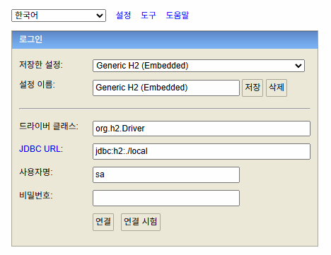
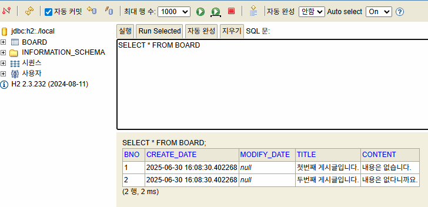

# java-springboot-2025

2025년 부경대 Java개발자과정 SpringBoot 리포지토리

## 1일차(04-01)

### 웹 개요

- 구성 3 단계
  - 브라우저(클라이언트 / 프론트엔드) - 사용자 **요청**을 하고, 결과를 돌려받는 파트
  - 서버(백엔드) - 사용자의 요청을 받아서 DB에서 데이터를 가져와 처리하고, 사용자에게 **응답** 하는 파트
  - 데이터베이스 - 가장 중요한 데이터가 저장되어 있는 파트
- 웹 개념
  - Request(요청)에 대한 Response(응답)

### Spring Boot 개요

- Java - 컴퓨팅 세상 모든 곳에서 사용 될 수 있는 언어가 되보자 개발됨
- 웹개발

  1. CGI(Common GateWay Interface ) - HTTP 프로토콜에서 정적인 데이터만 전달할 수 있는 웹기술
  2. Servlet - CGI를 개선한 Java 웹기술 .동적웹을 개발할 수 있음
     - HTML 코드를 전부 다 JAVA에서 작성해야 함
  3. EJB(Enterprise Java Bean) - 서블릿으로 대형 프로젝트를 개발할 수 있는 Java 웹기술
     - 무지하게 복잡!
  4. JSP(Java Server Page) - 웹페이지코드(HTML)에 자바소스를 포함시켜서 개발 할 수 있는 Java 웹기술
     - 확장자가 .jsp / 스파게티 코드
  5. Spring - Java 웹 개발에 전성기 .웹페이지와 자바영역 분리
     - 설정이 복잡
  6. Spring Boot - Spring 단점을 최소화. 설정을 간결화

- Spring Boot

  - Spring 기술을 그대로 사용(마이그레이션이 간단)
  - JPA 기술을 사용하면 ERD나 DB 설계를 하지 않고도 손쉽게 DB를 생성
  - TomCat Webserver가 내장! (설치 필요없음)
  - 서포트하는 기능 다수 존재(개발을 쉽게 도와줌)
  - 테스트용 JUnit, 로그용 Log4J2 모두 포함(설치 필요없음)
  - 프론트엔드를 다양하게 지원.JSP,**Thymleaf**, Mustache 등
  - MVC(Model View Controller)로 영역을 분리. 각 부분별로 따로 개발

- MVC
  

### Spring Boot 개발환경 설정

- 필요요소

  - Java,개발툴,데이터베이스

- Java

  - Java Runtime과 JDK(Java Developer Kit) 존재
  - https://www.azul.com/downloads/?package=jdk#zulu
  - https://adoptium.net/
  - https://jdk.java.net/

  - Java 17버전 이상설치
  - https://www.oracle.com/kr/java/technologies/downloads/
  - jdk-17.0.13_windows-x64_bin.msi 다운로드

  - 시스템정보에서(sysdm.cpl) 고급> 환경변수 PATH 설정
    - 새로 만들기
      - JAVA_HOME - 본인경로 입력
    - path에 %JAVA_HOME%\bin 추가 , 맨 위로
  - powershell
    - java --version

- Visual Studio Code 확장 설치
  - Java 검색
    - Extension Pack for Java 설치. Debugger for Java 등 총 7가지 확장 설치

### Java 기본 실행

- VS Code에서 명령팔레트 실행(Ctrl+Shift+p)
  - Java Create
    1. build tool > Maven
    2. No ArchType 선택
    3. Group ID 입력(com.example)
    4. Artifact ID 입력
    5. 저장위치 결정

### Spring Boot 설정

- Visual Studio Code 확장 설치
  - Spring 검색
    - Spring Boot Extension Pack 설치(추가 3개 확장 같이 설치됨)
    - Spring Initializer Java Support 설치
    - Spring Boot DashBoard 설치
  - Gradle(빌드툴)검색
    - Gradle for Java 설치

### Spring Boot 기본 실행(Java 프로젝트)

- JDK버전과 Spring Boot Initializr 에 선택하는 JDK버전이 일치해야

  - OS에 JDK버전이 17버전이면 17선택

- VS Code에서 명령팔레트 실행

  - Spring Initiallizr : Create a Maven Project 선택
  - Specify Spring Boot version: 3.3.10 (SNAPSHOT)
  - Specify project language : Java
  - Input Groupd ID: 본인 아이디 입력 / com.oatmealflyer
  - Input Artifact Id: spring01
  - Specify packaging type: Jar(Java archive, 압축파일)
  - Specify Java version : 17
  - Choose dependencies: Selected 0 dependencies
  - 저장위치 선택
  - **새 창 열기** - Spring BOOT 프로젝트가 루트폴더가 된 개발환경

- 실행방법

  - 코드 작성
  - Spring Boot Dashboard > Apps > 앱 실행

- 기초문법
  - [JAVA 기초문법](./JAVA_BASIC.md)
  - 기본,변수,자료형,연산자,흐름제어

## 2일차

- 기초문법 계속
  - [JAVA 기초문법](./JAVA_BASIC.md)
  - 흐름제어(반복문),배열,메서드,객체/클래스,상속

## 3일차

- 기초문법 계속
  - [JAVA 기초문법](./JAVA_BASIC.md)
  - 상속 ,인터페이스,예외처리,제네릭,컬렉션 프레임워크, 입출력

### Spring Boot Build Tool

- 개요
  - 프로젝트 빌드 과정을 자동화시켜주는 도구
  - 컴파일, 테스트, 패키징, 의존성 관리, 배포 등등 포함
- Maven
  - Java프로젝트 기본 빌드도구
  - 빌드, 패키징(jar/war 파일 생성),테스트 등을 한번의 명령으로 간편하게 처리
  - 가장 큰 특징이 외부 라이브러리 자동으로 다운로드, 관리
  - pom.xml(Project Object Model)파일로 빌드 설정 관리
    - 초기 설정시 빠졌거나 , 추가되어야 하면 xml 코딩으로 추가
  - VS Code 확장 중 Maven Dependency Explorer 등으로 확인
- Gradle
  1. 안드로이드용 오픈소스 빌드도구
  2. Maven Repository를 같이 사용
  3. Maven의 3,4번 특징을 그대로 가지고 있음
  4. build.gradle 파일 사용. Groovy 스크립트 지원
  5. 빌드과정을 병렬처리, 캐싱사용으로 Maven보다 10~100배 향상된 성능 구현

### Gradle 설정

- Gradle로 프로젝트가 제대로 동작하지 않으면
  - https://gradle.org/ 에서 gradle 다운로드
  - 설치 경로 확인, 설치
  - 시스템 등록정보 PATH 지정.

### Spring Boot 로그 설정

- Spring Boot를 colorizing 해주는 기능
- src/resources/application.properties

  ```shell
  spring.output.ansi.enabled=always
  ```

- 서버 재시작

## 4일차

- 기초 문법 마무리

  - [JAVA기초문법](./JAVA_BASIC.md)
  - 제네릭,컬렉션 프레임워크,입출력, 람다식, 스트림API

- Spring Boot 시작
- Gradle 오류 해결 방법

  - [Gradle](https://gradle.org/install/)
  - C:\Gradle 위치에 압축해제
  - sysdm.cpl 환경변수 GRADLE_HOME 경로 입력,확인(JAVA_HOME과 동일)
    
  - VS Code 설정
    

  Gradle Build Server : Enabled 기본 on-> off
  

  - Gradle Home -> 환경변수 입력한 GRADLE_HOME의 경로 입력
  - Gradle Java Home -> 환경변수 JAVA_HOME의 경로 입력
  - VS Code 재시작.

## 5일차

### Spring Boot 웹실행

- 프로젝트 초기화

  - Spring Initializr : Create a gradle project ...
  - Specify Spring Boot version : 3.4.4
  - Specify project language : Java
  - Input Group Id : com.oatmealflyer(각자 설정할 것)
  - Input Artifact Id: spring03
  - Specify packaging type:java
  - Specify Java version : 17
  - Choose dependencies : Selected 1 dependencies
    - Spring Web
  - 저장위치 선택
  - **새창 열기 ** - Spring Boot 프로젝트가 루트폴더가 된 개발환경

- 포트번호
  |프로토콜|포트번호|비고|
  |:---|---|:---|
  |HTTP|80|웹 서버,서비스 포트(보안취약)|
  |HTTPS|443|SSL를 적용한 웹 서버,서비스(보안강화)|
  |FTP|21|웹을 통한 파일전송|
  |TELNET|원격서버접속 서비스|
  |SSH|22|보안강화된 텔넷|
  |SMTP|25|메일 전송서비스

- 개발용 포트

  - 포트는 중복안됨
  - 8080 포트를 사용하고 있으면 다른 포트로 변경해야 함
  - 포트 변경시 application.properties에 `server.port = 8090` 추가

- 웹 브라우저 열기

  - http://localhost:8090/ 오픈

    

- 접속위치 요청 처리
  - 컨트롤러 생성
    - HelloController 클래스 생성
    - http://localhost:8090/hello
  - 각 기능별로 패키지를 구분
    - controller , model 등 ...
- Log-back

  - 스프링부트에 내장된 로그 모듈

  - application.properties 내 로그 설정

  ```groovy
  logging.level.root = info
  logging.file.name = /logtest.log
  ```

- 사용 시

```java
// 클래스 내 작성
private final
```

### 스프링 부트 배너 (중요도 없음)

- resources 폴더에 banner.txt 생성
- 내용 추가
- Spring Boot Banner Generator (https://devops.datenkollektiv.de/banner.txt/index.html)
- 배너제너레이터로 생성한 글자 복사 banner.txt 붙여넣기
- 서버 재시작
  

### 스프링부트 프로젝트 구조


- 각 폴더 구조
  - .gradle ~ gradle : 그레이들, VSCode, 빌드 등에 필요한 폴더(설명필요X)
  - `src/main/java` : 패키지와 자바 소스가 저장되는 위치
  - com.hugo83.spring03 : 패키지. 폴더로 구성
    - HelloController 클래스에 접근하려면
    - com.hugo83.spring03.controller.HelloController 접근해야 함
  - Spring03Application.java : 시작프로그램
  - src/main/resources : 자바파일 이외 HTML, CSS, JS, 환경파일 등 리소스파일 저장되는 위치
    - `static` : CSS, JS, 이미지 파일 저장되는 곳
    - `templates` : 스프링부트와 연계되는 HTML 파일 저장되는 곳
    - `application.properties` : 프로젝...

#### 어노테이션

- 한글로 주석이지만 , #, //,/\*\*/ 소스에 영향을 미치지 않는 주석과 다름
- 자바 소스에 추가해서 여러가지 기능을 수행하는 메타데이터 일종
- @로 시작,JDK 1.5 이상부터 사용가능
- 클래스 파일에 같이 포함된 JVM 작동시 실행됨
- 클래스, 메서드 바로 위에 작성. 코드와 설정을 관리할 수 있게 도와주는 역할

###### 1. @Override

- 오버라이드를 올바르게 했는지 컴파일러 체크
- 상속 , 인터페이스 구현시 사용

##### 2. @Deprecated

- 앞으로 다음버전에서 삭제될 수 있음. 사용하지 말것을 권유하는 체크
  

- 되돌기염ㄴ 이 함수 는 사용하지 말 것

###### 3. FunctionalInterface

- 함수형 인터페이스에 붙여서, 컴파일러가 올바르게 작성되었는지 체크

##### 4. @SuppressWarnings

- 컴파일러의 경고메시지가 표시되지 않음

#### @SpringBootApplication

- 스프링부트 자동구성 매커니즘 활성화
- 어플리캐이션 내 패키지에서 컴포너트를 스캐닝
- 설정 클래스 임포트해서 활성화, 스프링부트 실행

#### @Controller

- 컴포넌트 구체화해서 해당클래스 IoC컨테이너 Bean으로 등록

#### @GetMapping

- Get,Post 중 Get(URL)으로 들어주는 주소를 매핑. 처리해주는 역할
- @PostMapping , @RequestMapping 등 파악

#### @ReponseBody

- HTTP 요청의 자바객체가 처리한 body내용을 매핑하는 역할
- 자바의 String 문자열을 웹페이지에 렌더링.

## 6일차(06-26)

- Spring Boot JPS + Oracle + Thymeleaf + React

  - JPA - DB 설계 없이 엔티티 클래스만으로 테이블을 자동 생성해주는 기술 . SQL도 필요 없음
    - JPA 이전 - MyBatis. SQL + XML 으로 구성된 ORM 기술
  - H2 - Oracle, MySQL 등과 달리 인메모리DB. Spring Boot 에서 자동으로 실행해주는 DB
    - 개발할 때 사용 . 운영시 이전할 때 DB 종류에 관계없이 이전이 가능 . 개발동안 사용
  - Thymeleaf - JSP 단점을 보완한 템플릿 형태 FE 개발방식
    - Bootstrap 은 필수로 사용
  - 소셜로그인 - 구글,카카오,네이버 SSO 로그인 연동(OAuth 2.0)
  - React - FE를 완전 분리

- Spring Boot 프로젝트 생성

  1.  명령 팔레트로 시작 (Ctrl + Shift + P ) : Spring Initializer : Create a Gradle(Maven ) Project
  2.  Spring Boot version :3.5.3
  3.  Project language : Java
  4.  Group Id : com.pknu
  5.  Artifact Id : backboard
  6.  packaging type : Jar
  7.  Java version : 17
  8.  Dependency

      - Spring Boot DevTools : 개발 시 필요한 명령어, 기능 포함
      - Lombok : 어노테이션 등 편리하게 해주는 플러그인 라이브러리
      - Spring Web : 프론트엔드(html) 개발을 할 때 필요한 의존성
      - Thymeleaf : html + Spring Boot 태그 매핑을 해주는 기능
      - H2 Database (later) : 개발동안 필요한 인메모리 DB
      - Oracle Driver (later) : 실제 운영할 DB
      - Data JPA (later) : DB 생성 + ORM

  9.  저장 위치 지정 , C:\Source\java-springboot-2025\day06
      Generate into this folder 선택
  10. 오른쪽 하단 프로젝트 폴더 버튼 Open 버튼 클릭

  - Spring Boot BackBoard project
    - Gradle Plugin - Dependency 파악 . 프로젝트 업데이트
    - Spring Boot dashboard - 프로젝트 실행

- Spring Boot 설정파일
- build.gradle - 그레이들에서 설정할 구성내용
- application.properties - Spring Boot 프로젝트 자체 설정 파일
- settings.gradle,gradle-wrapper.properties 손댈 일 없음

### 스프링부트 BackBoard 프로젝트

1. 기본 실행
1. resources / application.properties

```properties
    server.port = 9097 # 포트 변경
    spring.output.ansi.enabled = always # 로그 색상 설정
    logging.level.root = info #로그 출력 레벨 설정
    logging.file.name=/backboard.log # 로그파일 위치
```

2. build gradle , Dependency

```gradle
  dependencies {
    // ... 생략
      // DB 연동용 의존성
        runtimeOnly 'com.h2database:h2' // 개발 시에만 사용하는 InmemoryDB H2
        implementation 'org.springframework.boot:spring-boot-starter-data-jpa'
  }

```

3.  Controller 작업

- MainController 생성
- 새 파일로 생성 or Menu Java New file > class 둘 다 동일
- 실행 : Ctrl + f5

4. /resources/templates/ 에 Mapping 메서드 리턴값과 동일한 html을 작성
5. DB 연동
6. H2 DB 의존성 추가
7. application.properties 에 H2 관련 설정 추가

   ```properties
         ## H2 DB 설정
     spring.h2.console.enabled=true
     spring.h2.console.path=/h2-console

     # H2 DB 파일위치 : ~/ (user/Admin/ 에 생성 ) : ./ 현재 프로젝트 폴더 생성
     ## JDBC URL :
     spring.datasource.url=jdbc:h2:./local
     spring.datasource.driver-class-name=org.h2.Driver
     spring.datasource.username=sa
     spring.datasource.password=
   ```

3.http://localhost:9097/h2-console 접속


4. application.properties에 JPA 설정

```properties
## JPA DB 설정
spring.jpa.properties.hibernate.dialect=org.hibernate.dialect.H2Dialect
spring.jpa.hibernate.ddl-auto=update
```

- JPA 등의 ORM 작업시 사용하는 기술 - 하이버네이트
- spring.jpa.hibernate.ddl-auto 종료
  - create : SB 서버 시작시 테이블을 모두 삭제후 재생성(데이터 모두 휘발)
  - create-drop : create 와 동일 .서버가 종료되면 테이블 모두 삭제
  - `update` : 엔티티 변경 부분만 적용 . 원래 있던 데이터 존재
  - `validate` : 엔티티와 테이블간 차이점 검사만
  - truncate : 데이터를 전부 날림
  - none :엔티티가 변경되어도 DB는 변경하지 않음

5. MVC 패턴에 맞춰 각 기능별로 패키지(폴더 ) 생성

- controller, entity,repository, service ...
  1. entity
  1. 테이블로 생성할 Board 클래스 생성
  1. Lombok @Getter/@Setter 를 사용하면 Get~,Set~ 메서드를 작성할 필요없음

6. @(Annotation) 정리

- Lombok
  - @Getter : getter 메서드 자동 생성
  - @Setter : setter 메서드 자동 생성
- JPA

  - @Entity : 테이블화 할 객체 선언
  - @Id : 테이블 PK
  - @GeneratedValue(strategy = GenerationType.AUTO)

    - AUTO : MySQL Auto Increment
    - IDENTITY : SQLServer Identity(1,1)
    - SEQUENCE : Oracle Sequence
    - H2 DB를 오라클 타입으로 사용하고 나중에 운영DB를 오라클로 갈아타겠다

  - @Column : 컬럼의 속성을 변경 (ex : @Column(name = "subject", length = 250))
    - name : DB 상의 실제 칼럼명르 엔티티와 다르게 사용할 때
    - length : 길이를 지정
    - updatable : 최초 작성이후 수정 여부 . false는 수정 불가
    - columnDefinition : "TEXT" MYSQL , "CLOB" Oracle.H2는 사용불가
  - SpringFramework

    - @CreatedDate : 생성일
    - @LastModifiedDate : 최종수정일에 대한 어노테이션

      7.entity 패키지(폴더) 작성

    1.  테이블로 생성할 Board 클래스 생성
    2.  Lombok @Getter/@Setter 를 사용하면 Get~,Set~ 메서드를 작성할 필요없음

    8.repository 작성

    1. DB상의 데이터를 조회, 저장,수정,삭제할 수 있게 도와주는 인터페이스
    2. SELECT -> findAll , INSERT -> save() 메서드를 기본 제공
    3. BoardRepository 인터페이스 생성

    4. 단위 테스트

    5. build.gradle에 JUnit 의존성 추가

    ```gradle
      // JUnit 단위 테스트
      testImplementation 'org.junit.jupiter:junit-jupiter'
    ```

    2. INSERT 단위 테스트
    3. test/.../backboard/BackBoardApplicationTests.java 에 단위 테스트 메서드 작성

      
    4. SELECT, SELECT ... WHERE 단위 테스트
    5. 디버그 콘솔에서 쿼리 로그로 확인. application.properties 설정추가

        ```
        properties
            ##테스트시 쿼리 확인
            spring.jpa.properties.hibernate.format_sql=true
            spring.jpa.properties.hibernate.show_sql=true
        ```

    6.SELECT ... WHERE LIKE, DELETE FROM 단위 테스트

## 7일차(07-01)

### 스프링부트 Backboard 프로젝트 (계속)
